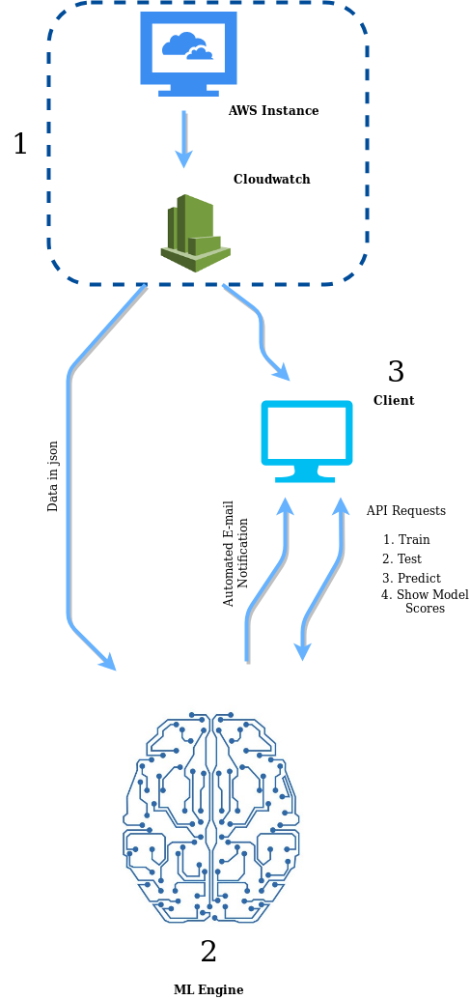

# Deployment
Deployemnet should be done in 3 platforms.
* AWS Instance and Cloudwatch Configuration
* ML Engine Deployment
* Client Side Deployment
#



The deployment should be done for each part as follows. 

Note: Unless specified, each command execution should be successfully finished before executing the next command. 

## 1. AWS Instance and  Cloudwatch Configuration

The already available metrics are visible in Cloudwatch under metrics category. By default, it does not provide memory utilization metric. Therefore, we have to push memory utilization data from EC2 instance to cloudwatch. Steps are given below.
Note: Your IAM role must be permitted to use the push-metric-data for this task.

* Log into the EC2 instance.
* Install the dependencies by executing below commands.
```
sudo apt-get update
sudo apt-get install unzip libwww-perl libdatetime-perl
```
* Download and extract the Cloudwatch monitoring script as follows.
```
cd /opt
wget http://aws-cloudwatch.s3.amazonaws.com/downloads/CloudWatchMonitoringScripts-1.2.1.zip
unzip CloudWatchMonitoringScripts-1.2.1.zip
```

* Get into the extracted directory and configure the credentials.
```
cd /opt/aws/aws-scripts-mon
sudo nano awscreds.template
```
* Now type the credentials and save the file. Then copy this file to config file as follows.

```
sudo cp awscreds.template awscreds.conf
```
* Now the setup is complete. Check the status by executing below command.
```
./mon-put-instance-data.pl --mem-util
```
* You should get a response as follows in case of successful setup of the script.
```
Successfully reported metrics to CloudWatch. Reference Id: b1a3050a-a45f-11e9-a745-9fd53b3ca01d
```
* Now to automate this reporting of data, the crontab should be edited as follows.
```
sudo nano crontab
```
* Enter the below line in the bottom of the crontab, exit with saving. 
```
*/5 * * * * /opt/aws-scripts-mon/mon-put-instance-data.pl --mem-used-incl-cache-buff --mem-util --disk-space-util --disk-path=/ --from-cron
```
Now the pushing custom metrics part is complete. To make sure the completion, log into the Cloudwatch console and check whether the custom metrics are shown in Metrics > All Metrics > Linux System

## 2. Deploying ML  Engine
The deployment can be done in the same instance which is monitored or in another dedicated instance. If the deployment is done in the same instance, configuring AWS is not required as it is already configured. If dedicated instance is used, configuration should be done as follows.
Follow this to install the AWS CLI on linux.
After the installation, configure the AWS CLI by executing below command and providing credentials. Enter ‘json’ as the output format. 

```
aws configure
```
After the configuration is done, a virtual environment should be created with required dependencies.
 
Input below commands in terminal. 

* Install Python3
```
sudo apt-get install python3
```
* Install pip3
```
python3 -m pip install --user --upgrade pip
```
* Install virtualenv
```
python3 -m pip install --user virtualenv
```
* Create a new vitrtual environment.
```
python3 -m venv env
```
* Activate the virtual environment.
```
source env/bin/activate
```

* Install the dependencies.
```
pip3 install tensorflow
pip3 install keras
pip3 install requests
pip3 install keras-tcn
pip3 install flask
```
* Clone this repository, cd into the cloned directory and execute below command.
```
sh engine.sh
```
Server side deployment is done.


## 3. Client Side Deployement


Below API requests can be used as a client. 

* Get the scores of the trained models. The response is a json containing model scores.
Send a GET request to ```<server ip>:<port>/compare```
Default port is 80 unless changed in engine.py .


For below API requests to be sent the client should get data as a json file from Cloudwatch. For that, configure the AWS CLI as described  here. 
Clone this Github repository.
Enter the needed credentials in ```queries.json``` and save it.

To get the dataset from Cloudwatch, send below API request.
The start time and end time can be varied accordingly.

```
aws cloudwatch get-metric-data --start-time 2019-07-08T00:00:00 --end-time 2019-07-11T23:00:00 --metric-data-queries file://./queries.json >> <name>.json
```
* Train a model using a dataset.
Get the ```training_api.py``` from this repository and modify with entering the json file name and server ip address, then run.

* Get predictions for a dataset.
Get the ```predict_api.py``` from this repository and modify with entering the json file name and server ip address, then run.
